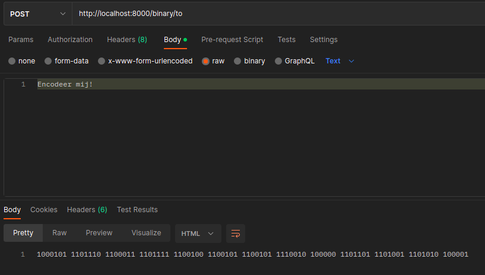
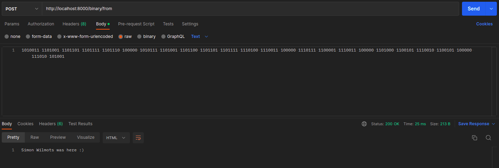

# binaryconverter_hapi_docker

## Launch Hapi API  
Run `npm install` in de src-directory en run `node server.js` of het `launch_binaryconverter.sh` script

## Gebruiken van de API
Ik had een client voorzien (index.html, client.js) maar ik krijg de CORS-errors niet opgelost.  
Daarom moet er 3rd-party software gebruikt worden voor de consumatie (bv. Postman)  
  
**Postman consumatie voorbeeld**  
*Het [export-bestand](Cloud_4090.postman_collection.json) van de Postman collectie staat in de root van deze repo.*  
  
Van string naar binary:  
  
  
Van binary naar string:  
